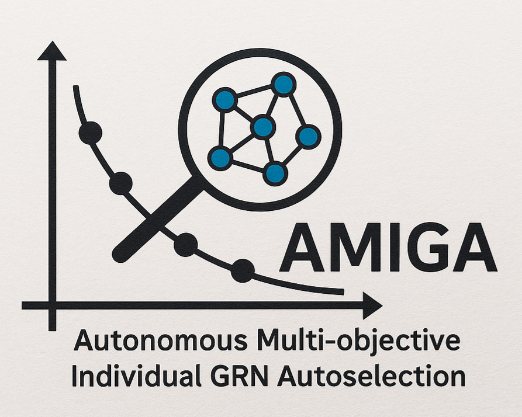
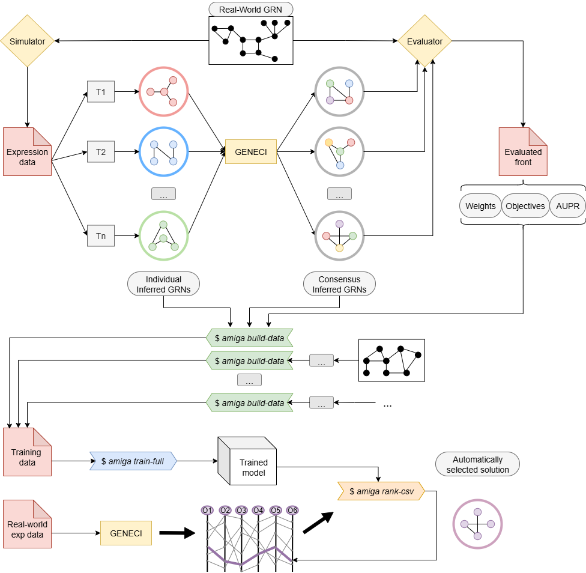

# 🧬 AMIGA: Autonomous Multi-objective Individual GRN Autoselection



**AMIGA** is an intelligent advisor designed to **assist users in the interpretation and selection of promising individuals** within Pareto fronts obtained from multi-objective algorithms for **consensus inference of Gene Regulatory Networks (GRNs)**.

In this domain, multi-objective algorithms often generate **large Pareto fronts** spanning a **high-dimensional and complex objective space**, making it difficult to identify the most reliable consensus solutions. AMIGA addresses this challenge by learning to **rank individuals according to their expected quality**, leveraging knowledge extracted from multiple benchmark instances where the ground-truth GRNs are known.

The ranking model integrates several heterogeneous information sources:

- The **weights** assigned to each inference technique within the ensemble.  
- The **optimization levels** achieved by the objectives composing the multi-objective problem.  
- A set of **features derived from the gene expression data**, shared by all individuals within a given front.  
- A comprehensive collection of **topological and structural features** computed over the **consensus networks** generated from each individual’s weight configuration.  
- The **target variable (AUPR)**, representing the similarity between each inferred consensus network and its corresponding gold-standard reference, used as the supervised signal during training.

To preserve the **independent and contextual nature of each benchmark front**, AMIGA implements a *group-aware Learning-to-Rank (LTR) strategy* that constrains both label preprocessing and model validation through the following measures:

1. **Intra-front normalization of target values (AUPR):** Before training, the AUPR scores are normalized *within each front* so that relevance labels represent the *relative quality of individuals* in their own context, eliminating cross-dataset scale bias.

2. **Group-aware cross-validation:**  The training process uses **GroupKFold**, where each front acts as a distinct group, ensuring that **no individuals from the same front appear simultaneously in training and validation folds**, thus preventing information leakage across benchmarks.

3. **Native group-based optimization in ranking models:**  The underlying models natively support the `group` (or `group_id`) parameter, which enforces the computation of **pairwise ranking gradients exclusively within each group**, never between them.

Together, these measures implement the standard *“learning-to-rank with grouped queries”* paradigm. This design enables AMIGA to capture **intra-front ranking patterns** while generalizing effectively across heterogeneous benchmarks.

By combining these elements, AMIGA provides a **generalizable mechanism for guiding the user** towards the most promising consensus networks, effectively transforming benchmark-derived experience into an **automatic ranking-based advisory system**. It serves as a **complementary module** to the [GENECI](https://github.com/AdrianSeguraOrtiz/GENECI) research line, ensuring full compatibility with all consensus-based tools developed within it, including [MO-GENECI](https://github.com/AdrianSeguraOrtiz/MO-GENECI) and [BIO-INSIGHT](https://github.com/AdrianSeguraOrtiz/BIO-INSIGHT).


---

## 🔬 Context and Motivation

During the development of **MO-GENECI**, an empirical pattern was identified: **the precision of individuals (AUROC and AUPR) varied smoothly across the Pareto front**, revealing a gradient-like behavior in the objective space.  Neighboring solutions tended to show similar performance when compared against the gold standards, which suggested the existence of **regions of consistently high precision**.  

This observation led to the design of **[PBEvoGen](https://github.com/AdrianSeguraOrtiz/PBEvoGen)**, where this insight was translated into a **preference-based evolutionary mechanism**.  In PBEvoGen, the evolutionary process was guided toward promising areas of the objective space by prioritizing individuals located near previously well-performing ones, enabling a more informed exploration strategy.

As the framework evolved into **[BIO-INSIGHT](https://github.com/AdrianSeguraOrtiz/BIO-INSIGHT)**, the optimization problem expanded to **six simultaneous objectives**, considerably increasing the dimensionality and complexity of the Pareto fronts.  In such a high-dimensional setting, **manual expert guidance becomes unfeasible**, as visually identifying the most promising regions or maintaining an intuitive sense of the front’s structure is no longer possible.

To address this limitation, **AMIGA** was conceived as an intelligent assistant capable of **learning from previously evaluated benchmark fronts** to support the user in two complementary ways:

1. **Post-optimization guidance:** helping experts interpret new Pareto fronts by ranking individuals according to their predicted biological precision.  
2. **Future integration with evolutionary search:** extending the philosophy of PBEvoGen by automatically selecting reference points or promising regions to **guide the ongoing optimization process**.

Through this design, AMIGA transforms accumulated benchmark knowledge into an **autonomous decision-support system**, bridging the gap between expert intuition and machine-driven exploration in multi-objective GRN inference.

---

## ⚙️ Architecture Overview

```
amiga/
 ├─ core/
 │   └─ main.py                # Core logic: LTR training, ranking, and feature extraction
 ├─ features/
 │   ├─ expression.py          # Metrics from gene expression matrices
 │   └─ grn.py                 # Metrics from GRNs
 ├─ selection/
 │   └─ learn2rank.py          # Learning-to-Rank models (LightGBM / XGBoost / CatBoost)
 ├─ utils.py                   # I/O utilities and data normalization
 └─ cli.py                     # Typer-based command-line interface
```

AMIGA is implemented in Python and designed to interoperate with **GENECI**, **MO-GENECI**, and **BIO-INSIGHT**, using the same file formats and feature conventions for GRNs and expression data.

---

## 🚀 Installation

AMIGA is managed with **Poetry**, which handles both dependency resolution and virtual environment management.

### 1️⃣ Create and activate a virtual environment (recommended)

```bash
python -m venv .venv
source .venv/bin/activate
```

### 2️⃣ Install Poetry (if not already installed)

```bash
pip install poetry
```

### 3️⃣ Install AMIGA and all its dependencies

```bash
poetry install
```

This command will automatically create a local environment (if not active) and install all dependencies listed in `pyproject.toml`, including:

* **GENECI 4.0.1.1**
* **LightGBM 4.6.0**
* **XGBoost 3.0.5**
* **CatBoost 1.2.8**
* **scikit-learn**, **scipy**, **networkx**, **python-louvain**, etc.

Once installed, the `amiga` CLI command becomes available system-wide.


## 🧩 Learning Process



AMIGA is trained on a **composite dataset built from multiple benchmark networks**, each one corresponding to a different academic reference GRN.  For every benchmark, the individuals belonging to its Pareto front form an independent *group*, and AMIGA creates **one training instance per individual** by combining all its numerical descriptors.  

This hierarchical structure —**individual < front < complete dataset**— allows the model to learn from diverse optimization scenarios while preserving the contextual independence of each front. The AUPR value obtained by comparing each individual’s consensus network against its benchmark gold standard acts as the supervised target variable.


### 1️⃣ Technique Weights per Individual

Each individual in a Pareto front encodes a **set of weights assigned to the base inference techniques** (e.g., GENIE3, ARACNE, CLR...).  
These weights determine how the consensus GRN is constructed from the ensemble of inferred networks and are used as direct numeric features. They capture how the contribution of each technique influences the resulting topology and precision of the consensus.


### 2️⃣ Objective Optimization Levels

The second group of features corresponds to the **optimization levels achieved by each objective function** during the evolutionary process. These values define the individual’s **position within the multi-objective space** (e.g., quality, degree distribution, motifs, dynamicity, etc.). By learning correlations between objective-space coordinates and real precision (AUPR), AMIGA can infer which regions of the front are likely to contain biologically relevant solutions.


### 3️⃣ Expression-based Features (shared across the front)

All individuals in the same Pareto front originate from the **same gene expression dataset**, so these descriptors are shared among them. They characterize the statistical structure, variability and temporal behavior of the expression matrix:

- **Global descriptors:** number of genes and conditions, mean, variance, range, skewness, kurtosis, and proportions of zeros/missing values.  
- **Per-gene statistics:** distribution of mean, standard deviation, and coefficient of variation (CV) across genes, including quantiles (p10, p50, p90).  
- **Per-condition statistics:** analogous descriptors across experimental conditions, plus a simple z-score outlier indicator for condition means.  
- **Correlation-based structure:** average and variability of gene–gene and condition–condition Pearson correlations (mean, std, |corr|₉₀%).  
- **PCA decomposition:** top-k explained variance ratios, effective rank (Shannon entropy of singular values), and spectral condition number — capturing dimensionality and redundancy of expression patterns.  
- **Temporal dynamics:** for time-series data, lag-1 autocorrelation and per-gene linear trend statistics (slope, R², and fraction of positive slopes).

These features summarize the **statistical and dynamical properties of the input data** driving the inference process, allowing AMIGA to contextualize results according to dataset complexity.


### 4️⃣ Consensus Network Features per Individual

For each individual, a **consensus GRN** is built from its technique weights, and a wide range of **weighted graph-theoretic descriptors** are extracted:

- **Global network metrics:** number of nodes and edges, total and average edge weight, weighted density, Gini coefficient of edge weights, and concentration of the top-X% strongest interactions.  
- **Strength-based features:** statistics (mean, std, max, Gini) of in-strengths, out-strengths, and total strengths; plus a *hub count* above mean + 2·σ.  
- **Assortativity:** weighted correlation between node out- and in-degrees, reflecting preferential attachment patterns.  
- **Shortest-path descriptors:** weighted average path length and 95th-percentile diameter within the largest strongly connected component (distances = 1 / Confidence).  
- **Clustering coefficient:** mean weighted clustering in the undirected projection.  
- **Community structure:** number of communities, weighted modularity, and community size distribution (mean, max) obtained via Louvain detection.  
- **Reciprocity:** proportion of bidirectional regulatory pairs weighted by the minimum confidence of reciprocal edges.  
- **Entropy-based summaries:** Shannon entropies of edge-weight and node-strength distributions, capturing network heterogeneity.

These descriptors quantify both the **structural organization and weight distribution** of each consensus network, providing rich topological information beyond raw performance metrics.


### 5️⃣ AUPR (Target Variable)

Finally, each individual is labeled with its **Area Under the Precision–Recall Curve (AUPR)**, computed by comparing its consensus GRN against the corresponding **gold-standard regulatory network**. This value acts as the **supervised target** in the Learning-to-Rank (LTR) model, enabling AMIGA to learn how combinations of technique weights, objective levels, and network or expression features relate to actual biological precision.


## ⚙️ Model and Labeling Parameters

AMIGA provides several configurable parameters that control how the ranking model is trained and how relevance labels are assigned within each Pareto front.

---

### 🧠 Ranking Model (`--model-type`)

The `ModelType` parameter defines which **Learning-to-Rank (LTR)** algorithm is used during training. All supported models are tree-based gradient boosting frameworks with built-in ranking objectives and native support for *grouped queries* (the Pareto fronts).

| Model | Objective | Description | Recommended use |
|:------|:-----------|:-------------|:----------------|
| **LGBMRanker** | `lambdarank` | Optimizes a differentiable approximation of NDCG using pairwise gradients. Highly efficient and scalable, ideal for most experiments. | **Default choice** — best balance between accuracy and speed. |
| **XGBRanker** | `rank:ndcg` | Uses a listwise NDCG loss with robust regularization and interpretability of feature importance. | Suitable for sensitivity analysis and feature relevance studies. |
| **CatBoostRanker** | `YetiRank` | Employs ordered boosting and internal randomization to mitigate overfitting. Handles categorical or imbalanced features gracefully. | Recommended when training data are limited or heterogeneous. |

All three models natively accept the `group` (or `group_id`) argument, ensuring that **pairwise ranking gradients are computed within each front only**, never across groups. This preserves the independence of benchmark fronts while still allowing the model to learn cross-front generalization patterns.

---

### 🏷️ Intra-front Label Construction (`--label-mode`)

The `LabelMode` parameter specifies how **relevance labels** (training targets) are derived from the AUPR scores **within each Pareto front**. Each mode defines a different way of expressing “how good” an individual is in the context of its front:

| Mode | Output range | Definition | Suitable for |
|:-----|:--------------|:------------|:--------------|
| **rank_dense** | 0…L–1 | Dense integer ranks without gaps; ties share the same rank, next rank is incremented by 1. | Discrete small fronts; stable and interpretable. |
| **rank_avg** | 0…L–1 | Average rank values when ties occur, then discretized; smoother than `rank_dense`. | Noisy fronts or metrics with frequent ties. |
| **quantiles** | 0…Q–1 | Divides AUPR values into *Q* quantile bins (e.g., quartiles or deciles). | When the distribution of AUPR is skewed or multi-modal. |
| **continuous** | 0.0–1.0 | Min–max normalization of AUPR within the front, preserving continuous relative distances. | Large fronts or when fine-grained sensitivity is desired. |

All labeling schemes are **intra-front only** — they never compare AUPR values across different benchmarks — ensuring that relevance remains context-specific to each front’s dynamics.

---

By combining these two components —a robust ranking model (`ModelType`) and a consistent label definition (`LabelMode`)— AMIGA can flexibly adapt to different dataset sizes, noise levels, and evaluation granularities while preserving the contextual independence of each benchmark.


## 📈 Evaluation Metrics

When using the `train-cv` command, AMIGA performs **group-aware cross-validation** via `GroupKFold`, where each benchmark front acts as an independent group. For each validation fold, several **ranking-oriented metrics** are computed both *per front* and *as aggregate means* across all fronts. These metrics evaluate the consistency and predictive power of the model in reproducing the true AUPR-based ranking within each front.

---

### 🧩 Per-front evaluation

For every front in the validation split, the following metrics are calculated:

| Metric | Description | Intuition |
|:--------|:-------------|:-----------|
| **NDCG@k** | *Normalized Discounted Cumulative Gain* at cutoff *k*. Measures how well the top-*k* ranked individuals match the ideal ordering based on true AUPR values. Values range from 0 to 1 (best). | Captures global ranking quality with emphasis on high ranks. |
| **P@1** | *Precision at rank 1*. Checks whether the top predicted individual is truly the best according to AUPR. | Simple accuracy on the top prediction. |
| **Regret@k** | Difference between the best possible AUPR and the best AUPR among the top-*k* predicted individuals. | Quantifies the expected loss of quality if only the top-*k* are selected. |
| **Spearman ρ** | Spearman rank correlation between predicted scores and true AUPR values. | Measures monotonic agreement between predicted and actual orderings. |
| **Kendall τ** | Kendall rank correlation between the same vectors. | More conservative measure of pairwise ranking consistency. |
| **n_items** | Number of individuals in the evaluated front. | Used for weighting and sanity checks. |

All metrics are computed **independently per front** to avoid mixing data from different benchmarks, ensuring that each evaluation reflects the model’s ability to reproduce intra-front orderings.


### 📊 Aggregated results

After evaluating all fronts in the validation fold, AMIGA aggregates results by taking the **mean across fronts** for every metric.  
This produces a single summary per fold (e.g., mean NDCG@10, mean Spearman), which can be averaged again across folds to assess global generalization.

This design provides a rigorous and interpretable validation protocol:
- Metrics are **context-aware** (computed per front, not globally).  
- The aggregation is **front-balanced**, preventing large fronts from dominating the evaluation.  
- The combination of *position-based (NDCG, P@1)* and *order-based (Spearman, Kendall)* metrics offers a complete view of ranking quality.

---

## 💻 Basic Usage

Below are the main commands provided by AMIGA for training, ranking, and feature extraction.  
Each command is implemented as a Typer subcommand and delegates the core logic to `amiga.core.main`.

### 1️⃣ Cross-validated training

```bash
amiga train-cv data/training.csv --model LGBMRanker --n-splits 5 --label-mode rank_dense -o output/
```

Performs **GroupKFold cross-validation** by Pareto fronts. Generates:

* Trained models per fold (`model_fold1.pkl`, …)
* Validation rankings per fold (`valid_fold1_ranked.csv`, …)
* Cross-validation metrics report (`cv_report.json`)
* Feature metadata (`feature_columns.json`)

### 2️⃣ Full training for production

```bash
amiga train-full data/training.csv --out ./output_full/
```

Trains a single **production-ready model** on the entire dataset.
Outputs:

* `model.pkl` – final model
* `feature_columns.json` – ordered list of features used during training
* `model_meta.json` – metadata including labeling mode and quantiles used

### 3️⃣ Ranking new fronts

```bash
amiga rank-csv data/new_front.csv output_full/model.pkl --out ranked.csv
```

Applies a trained model to unseen fronts and ranks individuals **within each front**.
Outputs a CSV with all original columns plus:

* `score` – model-predicted relevance
* `rank_in_front` – rank computed per front (1 = highest predicted quality)

### 4️⃣ Extracting expression-level features

```bash
amiga extract-expr-features data/expression.csv -o features_expr.json
```

Computes statistical and structural metrics from a gene expression matrix, including:

* Global descriptors (size, mean, variance, skewness, kurtosis)
* Per-gene and per-condition variability
* Correlation-based structure
* PCA decomposition (explained variance, effective rank)
* Optional time-series dynamics (`--include-timeseries`)

### 5️⃣ Extracting GRN-level features

```bash
amiga extract-grn-features data/GRN_GENIE3.csv -o features_grn.json
```

Computes **weighted graph metrics** from a directed GRN file (`Source, Target, Confidence`), including:

* Density, edge-weight distribution, and top-X concentration
* Node strength statistics (in/out/total)
* Weighted assortativity and reciprocity
* Path-based and clustering metrics
* Louvain modularity and community descriptors
* Optional advanced metrics (`--include-advanced`, e.g., entropy-based)

### 6️⃣ Building training datasets

Combines an evaluated Pareto front, its gene expression matrix, and the corresponding GRN files:

```bash
amiga build-data evaluated_front.csv expression.csv ./lists --front-id 1 --out data.csv
```

Creates a consolidated CSV merging:

* All columns from the evaluated front (except optional drops)
* Expression-level (`expr_*`) and GRN-level (`grn_*`) features
* The AUPR target for supervised training
  Each resulting row corresponds to **one individual** within the given front.

---

## 🧠 Citation

If you use **AMIGA** in your research, please cite it as:

> Segura-Ortiz, A., Giménez-Orenga, K., García-Nieto, J., Oltra, E., & Aldana-Montes, J. F. (2025). Multifaceted evolution focused on maximal exploitation of domain knowledge for the consensus inference of Gene Regulatory Networks. Computers in Biology and Medicine, 196, 110632.


