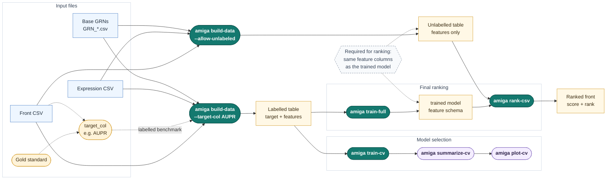

# AMIGA


**AMIGA** (*Automated Multi-objective Individual GRN Assessment*) is a Python
package and command-line tool for ranking candidate consensus Gene Regulatory
Networks (GRNs) produced by multi-objective evolutionary algorithms.

AMIGA acts as a post-Pareto decision layer. It learns from labelled benchmark
fronts where candidate quality is known, and applies the trained ranker to new
fronts where no gold standard is available.

The project is distributed on PyPI as `amiga-grn`; the import package and CLI
entry point are both named `amiga`.

## Installation

```bash
pip install amiga-grn
```

For local development:

```bash
git clone https://github.com/AdrianSeguraOrtiz/AMIGA.git
cd AMIGA
poetry install
```

Check the CLI:

```bash
amiga --help
```

## What AMIGA Uses

AMIGA expects one row per candidate solution in a Pareto front. A training table
usually contains:

- `front_id`: identifier of the Pareto front used as a learning-to-rank group;
- `item_id`: candidate identifier, generated when absent;
- a target column such as `AUPR` for labelled benchmark fronts;
- numerical predictors describing the candidate, objectives, expression context
  and consensus network.

At prediction time, the target column is not required. The new front must provide
the same predictor schema expected by the trained model.

## Quickstart

The usual AMIGA workflow is:


```mermaid
flowchart LR
    subgraph IN["Input files"]
        A(["Gold standard"])
        B["Front CSV"]
        T(["target_col<br/>e.g. AUPR"])
        C["Expression CSV"]
        D["Base GRNs<br/>GRN_*.csv"]
    end

    A -.-> T
    B -.-> T
    B --> E(["amiga build-data<br/>--target-col AUPR"])
    T -. "labelled benchmark" .-> E
    C --> E
    D --> E

    B --> F(["amiga build-data<br/>--allow-unlabeled"])
    C --> F
    D --> F

    E --> G["Labelled table<br/>target + features"]
    F --> H["Unlabelled table<br/>features only"]
    S{{"Required for ranking:<br/>same feature columns<br/>as the trained model"}}

    subgraph CV["Model selection"]
        I(["amiga train-cv"]) --> J(["amiga summarize-cv"]) --> K(["amiga plot-cv"])
    end

    subgraph FINAL["Final ranking"]
        L(["amiga train-full"]) --> M["trained model<br/>feature schema"]
        M --> N(["amiga rank-csv"])
    end

    G --> I
    G --> L
    H --> N
    S -.-> H
    S -.-> M
    N --> O["Ranked front<br/>score + rank"]

    classDef input fill:#eef6ff,stroke:#5083c7,color:#1d2b3a;
    classDef command fill:#14796f,stroke:#0a4f49,color:#ffffff,font-weight:bold;
    classDef artifact fill:#fff8e6,stroke:#d39b28,color:#3a2b10;
    classDef report fill:#f4edff,stroke:#8065bd,color:#2d2148;
    classDef chip fill:#fff3d9,stroke:#d39b28,color:#3a2b10;
    classDef note fill:#f8fafc,stroke:#64748b,stroke-dasharray: 4 3,color:#334155;
    classDef group fill:#ffffff,stroke:#cbd5e1,color:#334155;

    class B,C,D input;
    class A,T chip;
    class E,F,I,J,K,L,N command;
    class G,H,M,O artifact;
    class J,K report;
    class S note;
    class IN,CV,FINAL group;
```

### 1. Build AMIGA Tables

`build-data` is the main adapter between a consensus front and AMIGA. It takes
a candidate table, the expression matrix used to generate the front, and the
folder of base GRNs. The front table must contain one row per candidate and
weight columns named like `GRN_*.csv`.

For labelled benchmark fronts:

```bash
amiga build-data front.csv expression.csv base_networks/ \
  --front-id 1 \
  --target-col AUPR \
  --out labelled_front.csv
```

For real or unlabelled fronts:

```bash
amiga build-data front.csv expression.csv base_networks/ \
  --front-id 1 \
  --allow-unlabeled \
  --out unlabelled_front.csv
```

`build-data` preserves candidate/objective columns, assigns `front_id` and
`item_id`, extracts expression-level descriptors once per front, reconstructs
each weighted consensus GRN from the base networks and appends network
descriptors as `grn_*` columns. Useful options include:

- `--drop-front-cols`: remove columns from the original front before training;
- `--threads`: parallelize per-candidate consensus reconstruction;
- `--target-col`: choose the supervised quality column in labelled fronts;
- `--allow-unlabeled`: allow inference tables without a target column.

If you already have a complete AMIGA-compatible table, you can skip
`build-data` and train directly from that CSV.

### 2. Train And Evaluate With Grouped CV

`train-cv` trains one model per fold using fronts as groups. This is useful for
model selection, parameter tuning and reporting.

```bash
amiga train-cv labelled_fronts.csv \
  --model LGBMRanker \
  --label-mode continuous \
  --n-splits 5 \
  --model-params-json params.json \
  --out-dir cv_results/
```

Common options:

- `--model`: `LGBMRanker`, `XGBRanker` or `CatBoostRanker`;
- `--label-mode`: label construction strategy inside each front;
- `--label-quantiles`: number of bins when using quantile labels;
- `--front-col`, `--target-col`, `--id-col`: control-column names;
- `--drop-cols`: extra columns excluded from the feature matrix;
- `--model-params-json`: backend-specific hyperparameters;
- `--random-state`: base seed for reproducibility.

### 3. Summarise And Plot CV Results

`summarize-cv` aggregates one or more `cv_report.json` files into CSV tables.

```bash
amiga summarize-cv <cv_reports_dir>/*/cv_report.json \
  --out summary/ \
  --stats metric_rank_stats
```

`plot-cv` renders generic figures from the summaries:

```bash
amiga plot-cv --input-dir summary/ --plot dotplot_overview
```

Available plot names include `dotplot_overview`, `topk_curves`,
`metric_rank_heatmap` and `metric_scatter`.

### 4. Train A Final Model

```bash
amiga train-full labelled_fronts.csv \
  --model LGBMRanker \
  --label-mode continuous \
  --model-params-json params.json \
  --out-dir trained_model/
```

`train-full` uses the complete labelled table and stores `model.pkl`,
`feature_columns.json` and model metadata.

### 5. Rank A New Front

```bash
amiga rank-csv unlabelled_front.csv trained_model/model.pkl \
  --out-csv ranked_front.csv
```

When `feature_columns.json` is present next to the model, `rank-csv` uses the
same feature order learned during training.

### Optional Feature Utilities

`extract-expr-features` and `extract-grn-features` are standalone diagnostics
for inspecting descriptor blocks. They are not required before `build-data`,
because `build-data` calls the same feature extractors internally.

```bash
amiga extract-expr-features expression.csv --out expression_features.json
amiga extract-grn-features network.csv --out network_features.json
```

## Rankers And Labels

AMIGA currently supports three tree-based learning-to-rank backends:

- `LGBMRanker`
- `XGBRanker`
- `CatBoostRanker`

Labels are constructed within each front, never across unrelated fronts.
Supported label modes include continuous intra-front normalization, dense ranks,
average ranks, quantiles and negative-control modes for validation experiments.

Ranker-specific hyperparameters can be passed with `--model-params-json` in
training commands. This keeps AMIGA's CLI stable while still allowing advanced
configuration of the underlying backend.

## Reporting Metrics

`train-cv` evaluates rankings per front and then aggregates across fronts. The
main top-k metrics include:

- `Regret@k`: gap between the best true quality in the front and the best true
  quality found among the top-k recommendations;
- `BestAUPR@k`: best true AUPR recovered in the top-k;
- `Hit@k`: whether at least one true best candidate appears in the top-k;
- `NDCG@k`, Spearman and Kendall as complementary ranking diagnostics.

This design focuses on the practical decision problem: placing high-quality
candidate networks near the top of a short recommendation list.

## Research Workflow

The installable `amiga` package contains the reusable software core: feature
extraction, data construction, model training, cross-validation, reporting and
ranking.

The repository also contains an article-oriented workflow called `amiga-exp`
under `scripts/experiments/amiga_exp/`. It is not published as part of the PyPI
package in this release. It is tied to the repository layout, versioned case
manifests and publication plots, so it should be treated as a reproducible
research protocol rather than as a stable public API.

To use it, clone the repository and install the experiment dependency group:

```bash
git clone https://github.com/AdrianSeguraOrtiz/AMIGA.git
cd AMIGA
poetry install --with experiments
scripts/experiments/amiga-exp --help
```

The expected case directory contains a `data/` folder with `data_*.csv` files
and an `audit/` subfolder. The wrapper sets the repository on `PYTHONPATH`, so
it can call the local `amiga` implementation without requiring a separate
PyPI-only install.

Recommended command order:

```bash
scripts/experiments/amiga-exp inspect <case_dir>
scripts/experiments/amiga-exp validate <case_dir>
scripts/experiments/amiga-exp init-results <case_dir>
scripts/experiments/amiga-exp run-all <case_dir>
scripts/experiments/amiga-exp plot-all --case-dir <case_dir> --force
```

Useful lower-level commands:

```bash
scripts/experiments/amiga-exp run-phase <case_dir> 01_model_screening
scripts/experiments/amiga-exp run-phase <case_dir> 02_hyperparameter_tuning
scripts/experiments/amiga-exp run-phase <case_dir> final_test
scripts/experiments/amiga-exp run-phase <case_dir> 03_ablation
scripts/experiments/amiga-exp run-phase <case_dir> 04_decision_baselines
scripts/experiments/amiga-exp summarize-paper <case_dir>
scripts/experiments/amiga-exp plot-phase --case-dir <case_dir> --phase 01_model_screening
scripts/experiments/amiga-exp real-world-validate experiments/BIO-INSIGHT/real-world/tcga_brca
```

The standard phases are:

- `01_model_screening`: compare ranker families and label modes;
- `02_hyperparameter_tuning`: tune shortlisted configurations on development fronts;
- `final_test`: evaluate the frozen selected configuration on held-out fronts;
- `03_ablation`: quantify feature-block contributions;
- `04_decision_baselines`: compare AMIGA with post-Pareto decision baselines.

The `real-world-validate` command is specific to the TCGA-BRCA case reported in
the manuscript. It regenerates only the published real-world validation table:
Top1 recommendations for the five BIO-INSIGHT finalists, CollecTRI/DoRothEA/
TRRUST/JASPAR at top-250, Cistrome Cancer BRCA-COR at top-5000, and the two
reported metrics (`TF-target` and `TF-source`). It does not run the TCGA
download, BIO-INSIGHT optimization, AMIGA training or exploratory validation
analyses.

For now, `amiga-grn[exp]` is intentionally not provided. An optional PyPI extra
would install dependencies, but it would not make the article-specific case
manifests, plots and workflow a clean reusable API. If the experiment runner is
generalized later, it should become either a documented extra or a separate
research package.

See [`docs/experiments.md`](./docs/experiments.md) for the article-specific
workflow.

## Citation

If you use AMIGA, please cite the corresponding software release. A related
manuscript is currently in preparation.

## License

AMIGA is released under the MIT License.
