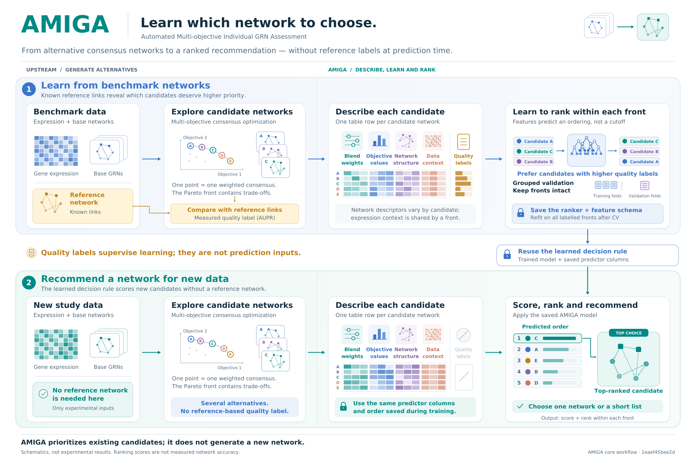

# AMIGA graphical overview



This figure describes the reusable AMIGA workflow: learning from labelled
benchmark fronts, saving a ranker and predictor schema, and ranking candidates
for new data without reference labels. The illustrations are schematic.

## Files and formats

| File | Purpose |
| --- | --- |
| `AMIGA_graphical_abstract.pdf` | Vector PDF with embedded font subsets, suitable for publication. |
| `AMIGA_graphical_abstract.svg` | Editable text and vector objects. |
| `AMIGA_graphical_abstract_outlined.svg` | Vector text paths for display without installed fonts. |
| `AMIGA_graphical_abstract.png` | 300-dpi rendering. |
| `AMIGA_graphical_abstract_preview.png` | Screen preview displayed in the repository README. |
| `build_figure.py`, `vector_engine.py` | Layout, illustrations and SVG/PDF drawing engine. |
| `figure_text.json`, `figure_config.json` | Wording, colours, fonts, dimensions and implementation provenance. |
| `requirements.txt` | Pinned drawing dependencies, separate from AMIGA's runtime. |
| `verify_build.py` | Artifact/source integrity, layout/vector checks and clean reconstruction. |
| `figure_caption.md`, `SOURCES.md`, `sources.json` | Figure description and mapping to the implementation. |
| `build_environment.json`, `layout_checks.json`, `text_geometry.json` | Actual build environment, font/source hashes and geometry. |
| `verification_report.json`, `SHA256SUMS` | Reconstruction results and delivered-file checksums. |

The canvas is 2120 × 1400 design units, with a default PDF width of 320 mm.
The editable configuration controls physical dimensions; PNG DPI controls
raster resolution. Text still needs sufficient space at the chosen display size.

## Regenerate in an isolated environment

From the repository root, create a drawing environment outside the environment
used by AMIGA and its experiments:

```bash
python3 -m venv /tmp/amiga-figure-venv
/tmp/amiga-figure-venv/bin/python -m pip install -r docs/graphical_abstract/requirements.txt
/tmp/amiga-figure-venv/bin/python docs/graphical_abstract/build_figure.py
/tmp/amiga-figure-venv/bin/python docs/graphical_abstract/verify_build.py --rebuild
```

Python 3.10 or newer and DejaVu Sans regular/bold fonts are required. Debian and
Ubuntu provide the fonts in `fonts-dejavu-core`. On other systems install
`DejaVuSans.ttf` and `DejaVuSans-Bold.ttf`, or specify their directory:

```bash
/tmp/amiga-figure-venv/bin/python docs/graphical_abstract/build_figure.py --font-dir /path/to/fonts
/tmp/amiga-figure-venv/bin/python docs/graphical_abstract/verify_build.py --rebuild --font-dir /path/to/fonts
```

Drawing is offline after dependencies and fonts are installed. It requires no
AMIGA installation, experiment results, benchmark data or reference image. The
sources draw vector shapes and text directly. Font files are not redistributed;
PDF font subsets and outlined SVG paths make the exported figures portable.

For another output directory or raster resolution:

```bash
/tmp/amiga-figure-venv/bin/python docs/graphical_abstract/build_figure.py --out-dir /tmp/amiga-rendered --dpi 600
/tmp/amiga-figure-venv/bin/python docs/graphical_abstract/verify_build.py --directory /tmp/amiga-rendered
```

`--rebuild` checks byte identity for the default 300-dpi delivery settings using
only the four drawing source/configuration files in a clean temporary directory.
Exact identity depends on matching dependencies and font files. The build records
actual versions and font hashes. The verifier refreshes `verification_report.json`
and `SHA256SUMS`; run it after any source or documentation change in this folder.

## Edit and verify

Edit wording in `figure_text.json`, style/dimensions in `figure_config.json`, and
geometry in `build_figure.py`. The validation note occupies two lines in a
reserved left column; the neighbouring fold icons occupy a separate column.
Text that exceeds its reserved width causes the build to fail.

Inspect the preview after rebuilding. The automatic checks cover text bounding
boxes, source/artifact hashes and vector-only PDF/SVG output. They do not prove
that every possible shape and arrow avoids every other object. `SHA256SUMS`
can also be checked from this directory with `sha256sum --check SHA256SUMS`.

## Relationship to AMIGA and amiga-exp

Reference networks supply benchmark quality upstream. `amiga build-data`
accepts those labels, reconstructs each supplied consensus candidate to compute
network descriptors, and extracts expression descriptors once per front.
Identifiers and the supervised target are excluded from prediction features.

The four predictor blocks represent mixture weights, objectives, network
structure and expression context. Context is shared within a front; network
structure varies by candidate. The saved predictor schema determines the
columns and order used at prediction time. The output is a table of `score`
and `rank_in_front`; a top candidate or shortlist can be selected from it.
The highlighted graph is the same schematic candidate C from the input front.

“Grouped validation / Keep fronts intact” applies to the common principle of
preserving groups. The reusable core uses `GroupKFold` by `front_id`. The current
[experimental protocol](../experiments.md) additionally partitions whole topology
groups and performs nested relevance, parameter, column and family selection.
The figure is a conceptual training/deployment overview; it does not display
all experimental phases, fold counts, comparator methods or results.

The tree drawings denote a tree-based ranker with one selected backend, rather
than an ensemble of LightGBM, XGBoost and CatBoost. Reference labels are not
prediction inputs. A ranker's score is not measured AUPR, and the illustration
does not assert that its highlighted candidate is biologically correct.
